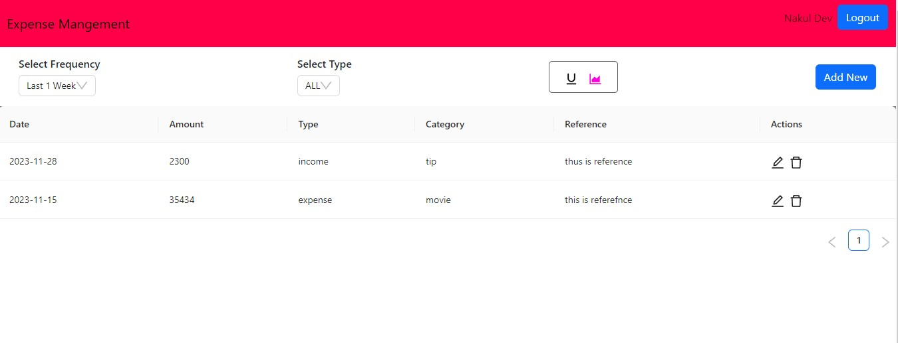
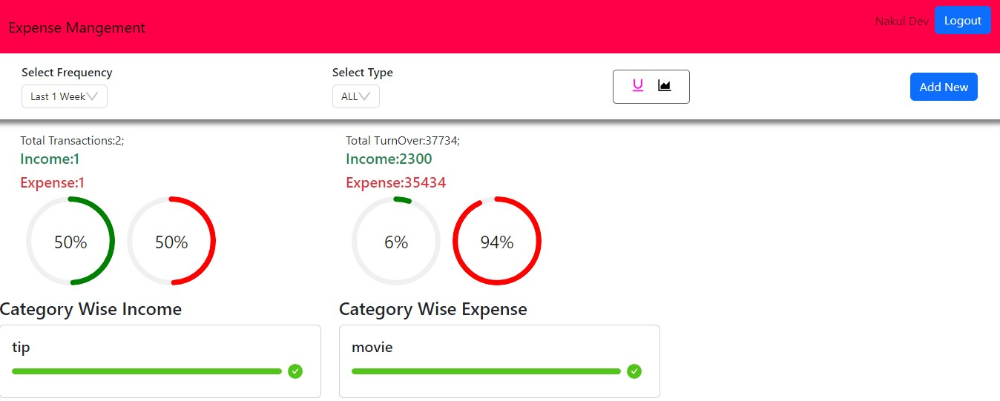

# Money-Minder"# XenonStack_Project_Money" 


Hosted At : https://cooperative-pear-tam.cyclic.app/login


<!-- Title -->
<h1 align="center">📊 Expense Management System (MERN Stack) 📈</h1>

<!-- Description -->
<p align="center">
  
</p>

<!-- Brief Description -->
<p align="center">An intuitive Expense Management System built with the MERN stack for easy expense tracking, budget management, and visualization. 💸✨</p>

<!-- Badges -->
<p align="center">
  <!-- Add badges here -->
  <!-- Example:  -->
</p>


<!-- Features -->
## Features 🚀

- **User Authentication:** Secure registration and login functionality. 🔐
- **Expense Tracking:** Add, edit, and manage expenses effortlessly. 📝
- **Dashboard:** Visualize expenses, budgets, and generate reports. 📊
- **Categories & Tags:** Organize expenses for better management. 🏷️
- **Responsive Design:** Ensure compatibility across devices. 📱

<!-- Technologies Used -->
## Technologies Used 💻

- **Frontend:** React.js, HTML5, CSS3, JavaScript
- **Backend:** Node.js, Express.js
- **Database:** MongoDB

<!-- Installation -->
## Installation 🛠️

1. Clone the repository: `git clone [repository URL]`
2. Install dependencies:
   ```bash
   cd backend
   npm install
   
   cd frontend
   npm install

   npm dev run
<!-- Description -->
<p align="center">
  
</p>

#!/bin/bash

function show_help() {
    echo "Usage: internsctl [command] [options]"
    echo "Commands:"
    echo "  cpu getinfo                  Get CPU information (similar to lscpu)"
    echo "  memory getinfo               Get memory information (similar to free)"
    echo "  user create <username>       Create a new user with login access"
    echo "  user list                    List all regular users"
    echo "  user list --sudo-only        List users with sudo permissions"
    echo "  file getinfo <file-name>     Get information about a file"
    echo "  file getinfo [options] <file-name>"
    echo "                               Get specific information about a file"
    echo "Options:"
    echo "  --size, -s                   Print size"
    echo "  --permissions, -p            Print file permissions"
    echo "  --owner, -o                  Print file owner"
    echo "  --last-modified, -m          Print last modified time"
}

function cpu_getinfo() {
    lscpu
}

function memory_getinfo() {
    free
}

function user_create() {
    username="$1"
    sudo useradd -m "$username"
    echo "User '$username' created successfully."
}

function user_list() {
    if [[ "$1" == "--sudo-only" ]]; then
        getent passwd | cut -d: -f1,3,4 | awk -F: '$2 >= 1000 {print $1}' | xargs groups | grep -E "\bsudo\b" | cut -d: -f1
    else
        getent passwd | cut -d: -f1,3,4 | awk -F: '$2 >= 1000 {print $1}'
    fi
}

function file_getinfo() {
    file="$1"
    if [[ -z "$2" ]]; then
        stat "$file" --printf="%n\tAccess: %A\tSize(B): %s\tOwner: %U:%G\nModify: %y\n"
    else
        case "$2" in
            --size|-s)
                stat "$file" --printf="%s\n"
                ;;
            --permissions|-p)
                stat "$file" --printf="%A\n"
                ;;
            --owner|-o)
                stat "$file" --printf="%U\n"
                ;;
            --last-modified|-m)
                stat "$file" --printf="%y\n"
                ;;
            *)
                echo "Error: Unknown option. Use 'internsctl file getinfo --help' for usage information."
                exit 1
                ;;
        esac
    fi
}

# Main script logic
case "$1" in
    cpu)
        cpu_getinfo
        ;;
    memory)
        memory_getinfo
        ;;
    user)
        case "$2" in
            create)
                user_create "$3"
                ;;
            list)
                user_list "$3"
                ;;
            *)
                echo "Error: Unknown option. Use 'internsctl user --help' for usage information."
                exit 1
                ;;
        esac
        ;;
    file)
        file_getinfo "$2" "$3"
        ;;
    --help)
        show_help
        ;;
    *)
        echo "Error: Unknown command. Use 'internsctl --help' for usage information."
        exit 1
        ;;
esac

